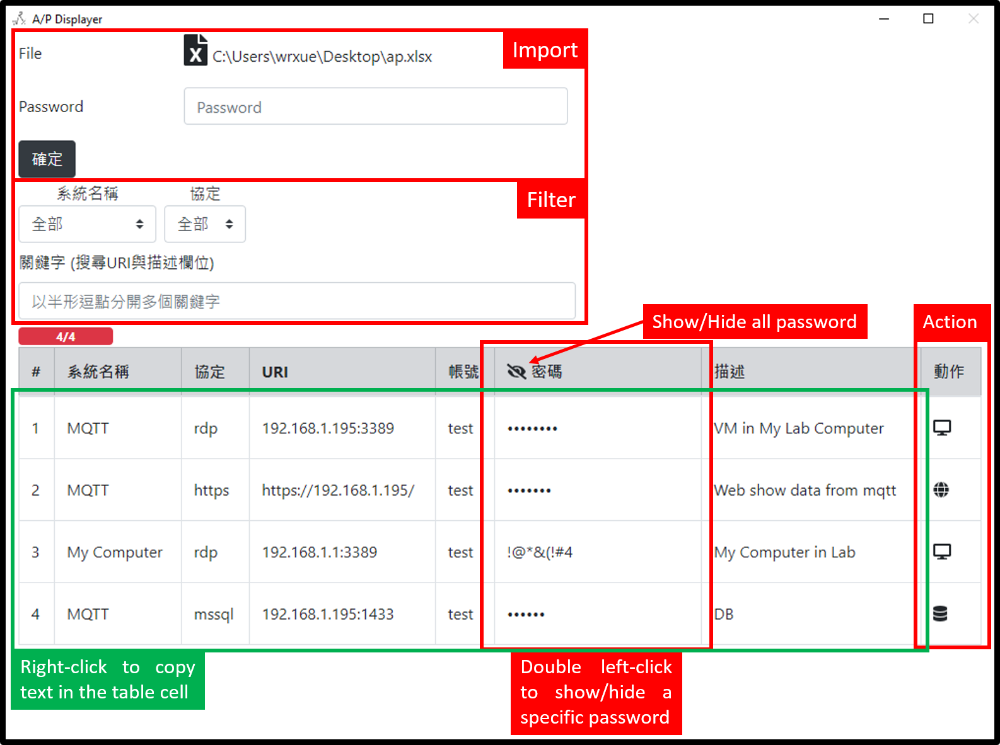
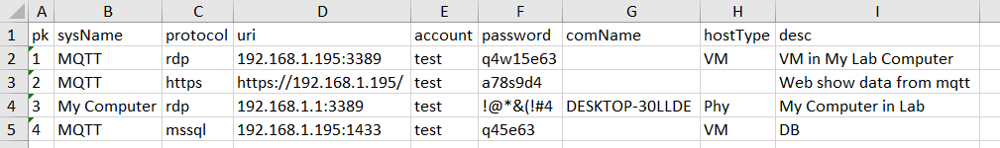

# Account/Password Displayer

## 為什麼要使用此專案？
這是一個將存在excel的帳密表，透過應用程式顯示資訊的專案（即將xlsx檔案作為DB，只執行SELECT Query）。  
使用此專案有幾個好處：  
1. 此專案可以處理受加密的xlsx檔案（需輸入正確密碼）。這樣就不用擔心excel外流。:sparkles::thumbsup::sunglasses:
1. 也由於是使用excel當作db，因此**不會有任何可能性將帳密存於別人的資料庫內**，非常安全。:clap:
1. **可以根據自己的喜好隱藏或顯示密碼**，有人在旁邊偷看時也只能看到帳號而不知密碼，比直接開excel好多了！:clap:
1. 可以直接點擊按鈕執行動作，隨著不同協定而有不同效果。例如  
    1. 協定為rdp：**自動化開啟遠端軟體**，自動輸入目標IP（uri），並帶著帳密登入，免去剪剪貼貼輸入IP/帳密的繁雜程序。:clap:
    1. 協定為http/https：網頁登入形式太多，因此不協助登入，將會**使用系統預設瀏覽器開啟該網址（uri）**，用滑鼠右鍵點擊應用程式中的表格即可直接複製帳號與密碼，省去框選/複製的時間，直接於登入欄位貼上資訊。:clap:
    1. 其他協定：目前尚未實作。
1. 可以**使用下拉式選單**或者**關鍵字**篩選出想要的資訊  
    1. 下拉式選單：根據系統名稱（sysName）與協定（protocol）欄位作篩選。:clap:
    1. 關鍵字：根據URI、描述（desc）欄位作篩選。:clap:  

## 如何使用？
1. 首先下載專案中的tempalate.xlsx檔案。:arrow_down:
1. 開啟，可看到已經有定義好的一排標頭（請勿更動），根據定義增加紀錄即可。:heavy_plus_sign:
    1. pk：主鍵，所有紀錄不可重複。:heavy_check_mark:
    1. sysName：系統名稱，可任意自取。:heavy_check_mark:
    1. protocol：協定名稱，目前有定義的為http/https/rdp/mssql，其他可以任意自取。:heavy_check_mark:
    1. uri：根據協定不同而有所不同，例如http的uri應為其網址，而rdp的uri應為IP:Port，不可為空。:heavy_check_mark:
    1. account：帳號。:heavy_check_mark:
    1. password：密碼。:heavy_check_mark:
    1. comName：主機名稱，可為空，不會在應用程式中顯示，可任意自取。:heavy_check_mark:
    1. hostType：主機型態，可為空，例如實體（Phy）或虛擬（VM），不會在應用程式中顯示。:heavy_check_mark:
    1. desc：描述此紀錄。:heavy_check_mark:  
    
1. 新增好紀錄後存檔，並視需求加密excel檔案。:lock:
1. 開啟此專案exe檔案，選擇檔案並輸入密碼（若有的話）。:key:
1. 將會列出excel內的資訊！:100::trollface: